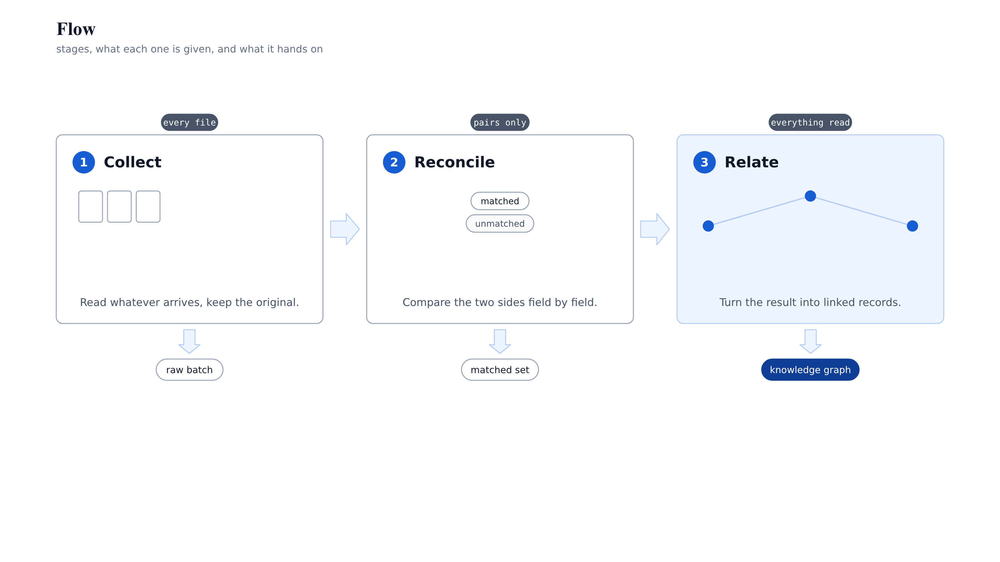
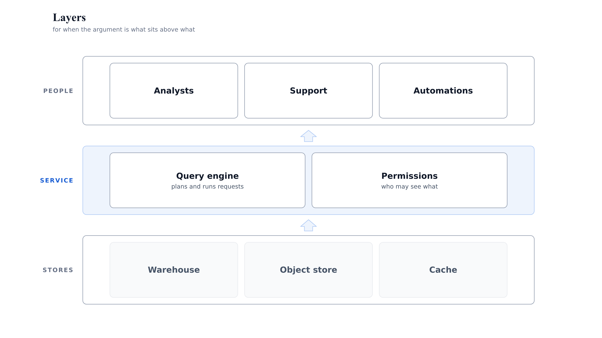
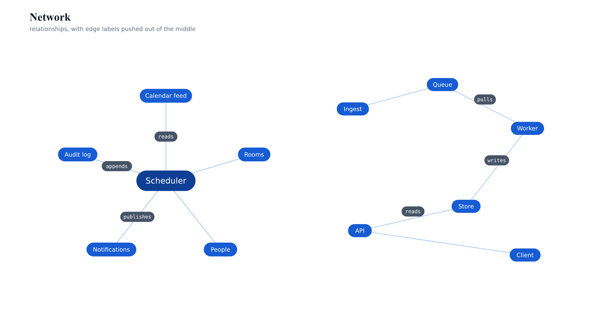
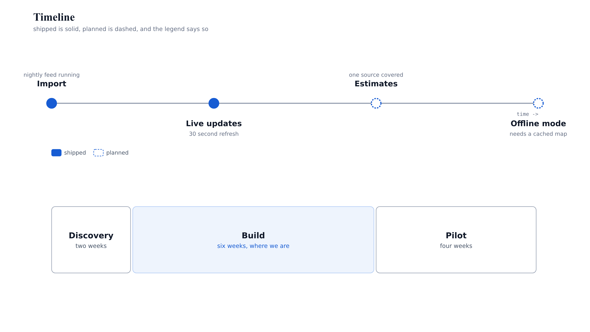
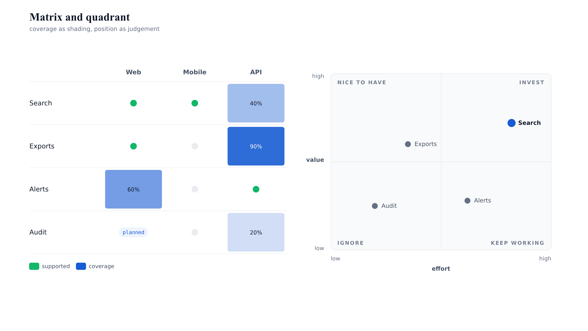
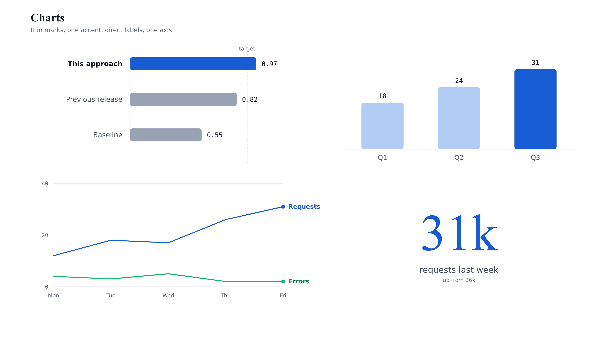
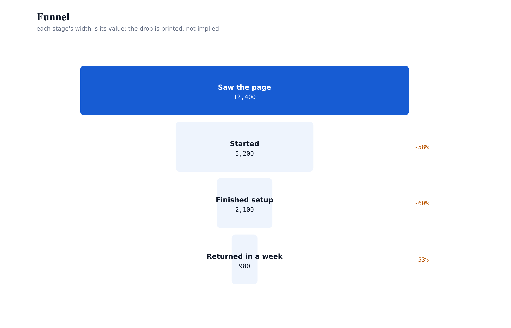

# figura

**Generate explanatory figures from code, and have the build tell you when one is broken.**

figura draws diagrams the way a designer would place them, from a Python API: text is measured
before anything is drawn, positions are computed, and the canvas remembers every element's bounding
box so the figure can check itself for collisions, occlusion, unreadable sizes and low contrast.

```python
from figura.canvas import Canvas
from figura.figures import flow

c = Canvas(1600, 900, theme="light")
flow.pipeline(c, [
    {"name": "Collect",   "scope": "every file",     "body": "Read whatever arrives.", "output": "raw batch"},
    {"name": "Reconcile", "scope": "pairs only",     "body": "Compare field by field.", "output": "matched set"},
    {"name": "Relate",    "scope": "everything read","body": "Link what was read.",    "output": "knowledge graph"},
])
assert not [f for f in c.verify() if f.level == "error"]   # fails the build if the figure is broken
c.save("pipeline.svg", png=True)
```



## Why this exists

Auto-layout tools give you a diagram in ten seconds and no control over the result. Drawing tools
give you control and no memory: nothing is generated, nothing is verified, and a palette change is
an afternoon. figura keeps the control and adds the memory, because it knows how wide every label
is before it draws it. `docs/why.md` explains the mechanism.

## What you get

- **Measured text** (`figura.text`): width, fitted size, wrapping, block fitting, with no browser.
- **Computed layout** (`figura.geom`): rows, columns, grids, radial placement, orthogonal and curved
  routing, edge intersection, and collision-aware label placement.
- **Shapes that size themselves** (`figura.shapes`): boxes that fit their text, pills, chips,
  block and thin arrows, three-quarter platforms, callouts that pick a free side, badges, legends.
- **Ten figure recipes** (`figura.figures`): layers, flow, network hub and mesh, timeline and
  phases, matrix, quadrant, funnel, bar / column / line / stat charts, and image annotation.
- **Verification** (`figura.verify`, `verify/measure.mjs`): geometry rules in milliseconds, plus an
  exact browser pass when it matters.
- **Themes** (`themes/*.json`): light, dark and print. One figure, three looks, no code change.

## Try it

```bash
python3 bin/viz gallery --png      # build every figure in gallery/, fail on any geometry error
node verify/measure.mjs gallery/03-network.svg
open gallery/                      # then look: a checker cannot tell you a figure makes its point
```

Requirements: Python 3.9+ (no packages) for drawing and checking. A rasteriser only if you want PNG:
`rsvg-convert`, Inkscape, `cairosvg`, or the bundled `verify/shot.mjs` with Playwright.

## Gallery

| | |
|---|---|
|  |  |
|  |  |
|  |  |

Every figure above is built by the file of the same name in `gallery/`, and every one fails its own
build if a label collides.

## Docs

`docs/why.md` (the mechanism) · `docs/recipes.md` (the catalogue) · `docs/verification.md` (rules and
limits) · `docs/extending.md` (your own shapes and recipes) · `docs/embedding.md` (slides, docs, web,
print) · `docs/alternatives.md` (when Mermaid, Graphviz, D3 or a drawing tool is the better answer).

## Scope

figura draws explanatory figures. It is not a charting library for statistics, not an automatic
graph router, and not an animation tool. `docs/alternatives.md` says so plainly and points you at
the right tool when this is the wrong one.

## Licence

MIT. All example content is invented.
